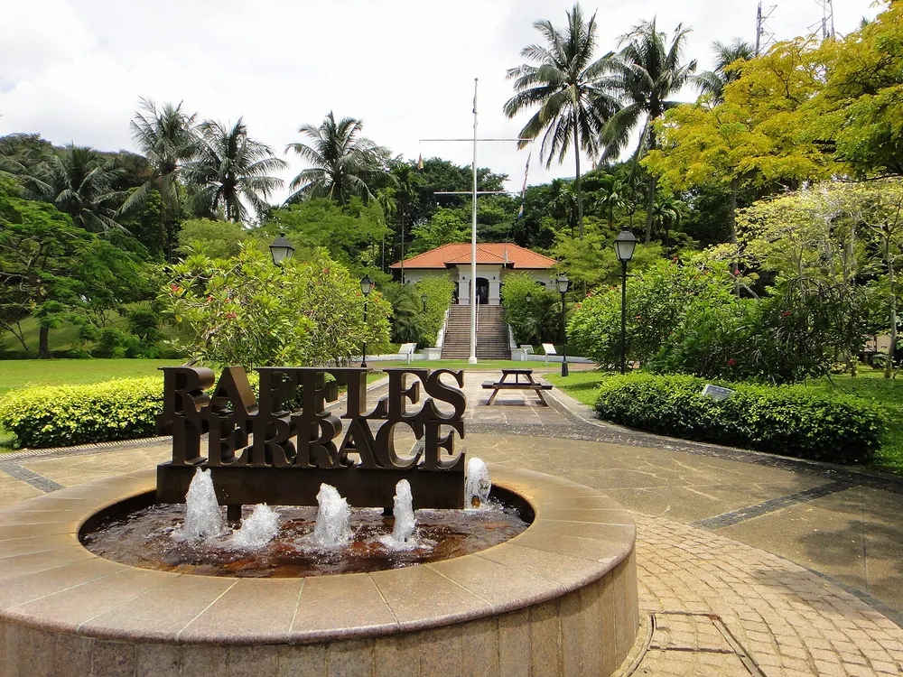
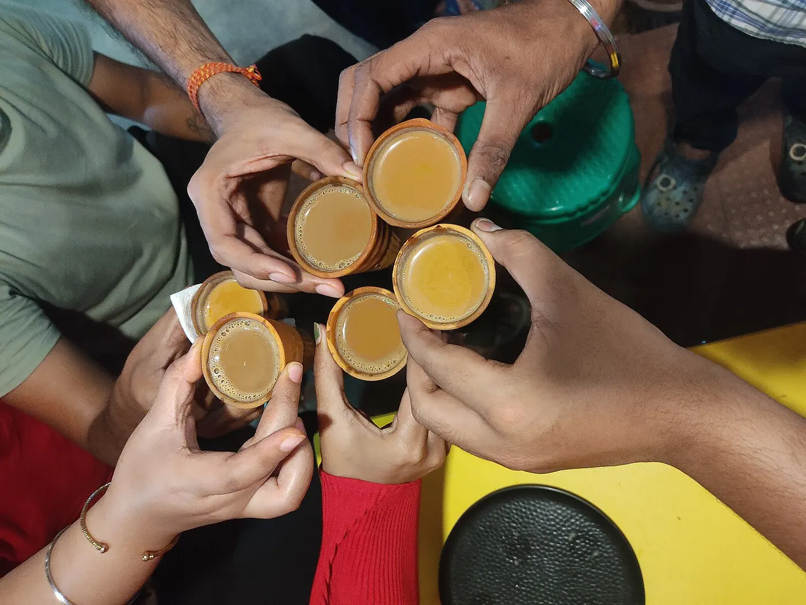

The offer said Associate Product Manager.

I had wanted those words. At IIT I coordinated the Product Management Club, and I did it without really knowing what a product manager was. Then a few months at Aspire, in Singapore, as a junior product manager. So when the PPO came, I treated the title like the job.

People still ask what a first year as a product manager looks like. On 9 June 2025 I would have answered with that line.

Bangalore. A laptop on the desk. A seat I was glad to have. I thought the seat came with a route.

## What a first year as a product manager actually is

A job post will tell you a clean story. Sherif Mansour, in [Atlassian's guide to the role](https://www.atlassian.com/agile/product-management/product-manager), calls a product manager the person who drives the product. The strategy. The roadmap. The features. A clear picture of what success looks like.

I would have agreed with every line of that, the week before I joined.

What I walked into was plainer. Design in one conversation. Engineering in the next. Marketing after that. Then a short page, so the thing we had agreed could move.

I've written about [what that seat became later](/blog/how-my-pm-job-changed-in-a-year), once the days moved. This is the stretch before. Ordinary months, while the title still looked like the whole story.

For a long while, that was the work. Not a smaller version of a keynote. The conversation, and the sentence you walk out holding.

I was hired to keep teams talking. In those months, I did.

## The junior product manager job had a finish line

Aspire had edges. I still feel that when I look back.

January to May 2023. I owned a migration of high-value accounts from one payment rail to another, Nium in Singapore to DBS in Hong Kong. Next to that, integrations that synced bank feeds into QuickBooks Online and Xero.

You could tell when it had gone right. The migration error rate stayed under 1.25 percent. Customer satisfaction went up 15 percent. Operating cost came down 10 percent. I keep those numbers because they trained my eye. A job you could call finished.

The Convin seat didn't arrive like that.

I started as an intern. Then the PPO. Then the associate product manager title. I said yes the way I had said yes to the club. It felt right. I didn't yet know what an ordinary week would ask. The longer road to that yes, from Darjeeling through IIT, is the one in [from the hills to Dhanbad](/blog/from-darjeeling-to-iit-dhanbad).

An associate product manager sounds, on a careers page, like a smaller copy of a bigger job. My APM first year didn't feel like a copy. It felt like being handed the thread between teams, and finding out the thread was the work.

No error rate on the wall. No morning when the migration was over. The next conversation, and a check on whether we were still talking about the same thing.

## What a product manager does on an ordinary Tuesday

I can't replay one Tuesday with names in it. I can tell you the shape, because the shape was the job.

Say your Tuesday looks like this. Design wants the flow to feel simple. Engineering wants it possible this week. Marketing wants a line they can say out loud. None of them is wrong. They just aren't saying the same thing yet.

The afternoon is turning those three purposes into one line, and writing the line down before it splits again. Take that as a picture. It's the shape those months had.

The work was keeping that sentence alive after everyone went back to their own queue.

I said yes a lot while I learned the shape. I wanted the PPO to look like a good decision. What those hours cost, and the rides and the pages I took back, I wrote about in [why hobbies matter once the job gets loud](/blog/why-hobbies-matter-in-corporate-life).

That was the product manager job reality. The page. The meeting after the page. And a last look, to see if the sentence had survived the walk back to the desks.

## The associate product manager title stayed. The week did not.

I liked that work. I still think a shared sentence is product work, even when it would look dull on a careers page.

The words on the offer barely moved. Intern, then PPO, then associate product manager, and then those same words on the same seat. Under them, the week wouldn't sit still. I didn't announce a new plan. The work that showed up kept deciding what the afternoon was for.

Some afternoons I was in the middle of three conversations. Some afternoons the ask on the table had already changed, and the title had not moved with it. I didn't need a new title to notice. I needed to look at the afternoon.

What the seat became after those first months is a different piece. I've already told it. What belongs here is the opening stretch of a first year as a product manager. The surprise wasn't one hard week. It was how long a title can stay put while Tuesday keeps getting rewritten.

## If this is your APM first year

A few things I wish had been on the desk in June.

The title gets you into the room. The job is whatever is on the table when you sit down.

If the role you came from had a clean number, a migration, a day you could call done, you will miss it. Write the thread down anyway. Early on, the number worth having is a simple one. Did the same sentence make it through three teams?

Give the work your good hours. Keep one thing that stays yours. I gave the hours away first. I wrote later about what I took back.

If the week starts changing under you, stay with what's on the table. Get it into one sentence before the room leaves. That's what a first year as a product manager actually trains. The title can keep still. Tuesday will not.

I still like the work. I still do it from this city.

I just stopped reading the line on the offer as a description of the day.
