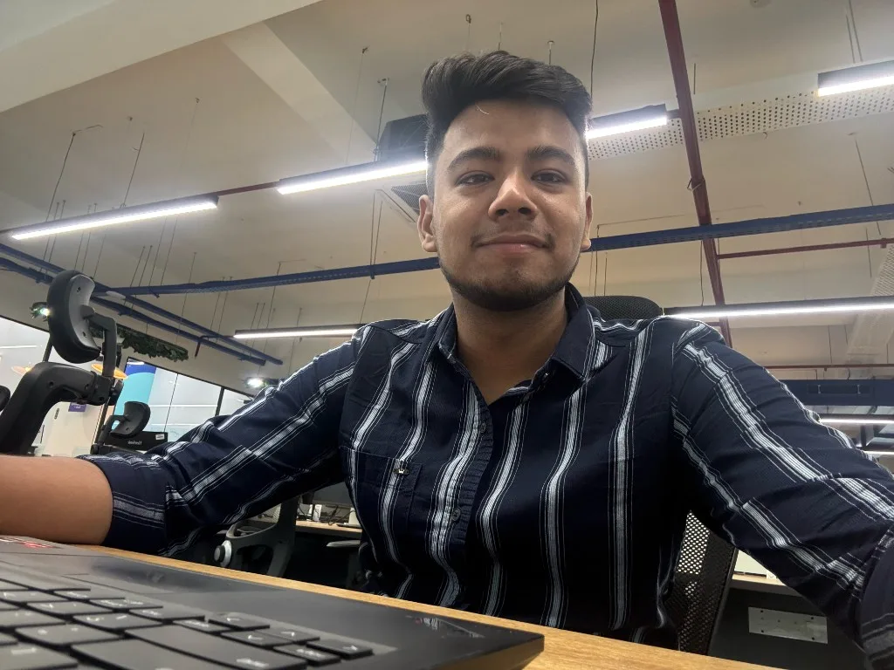
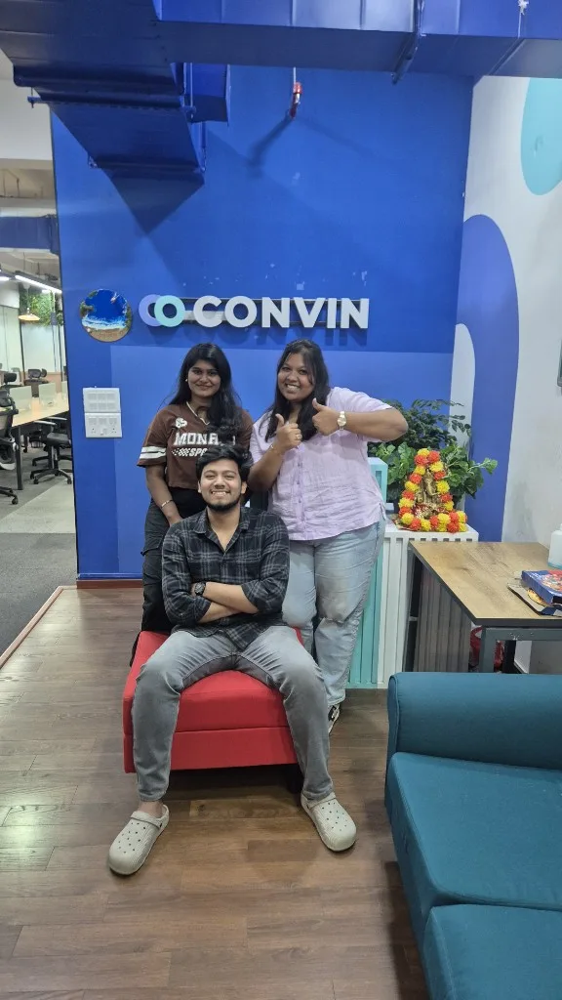
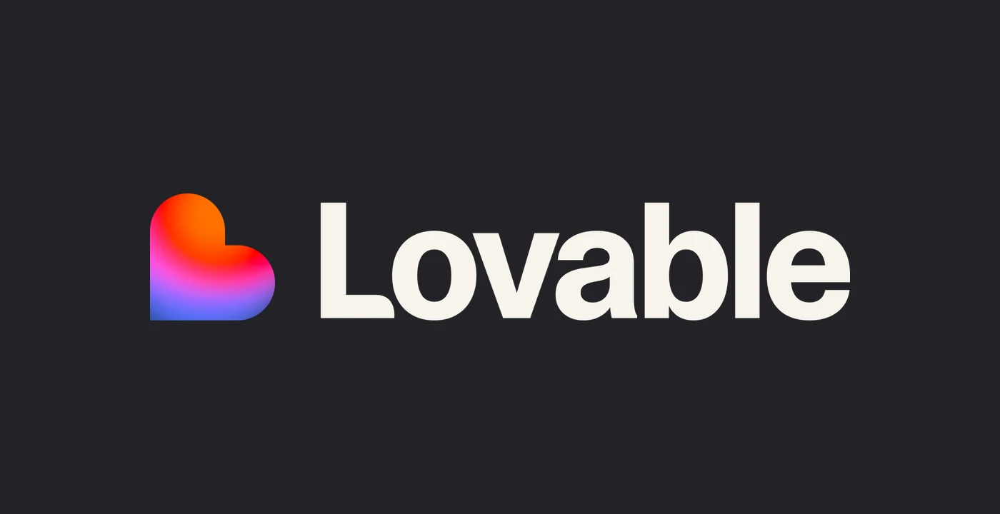
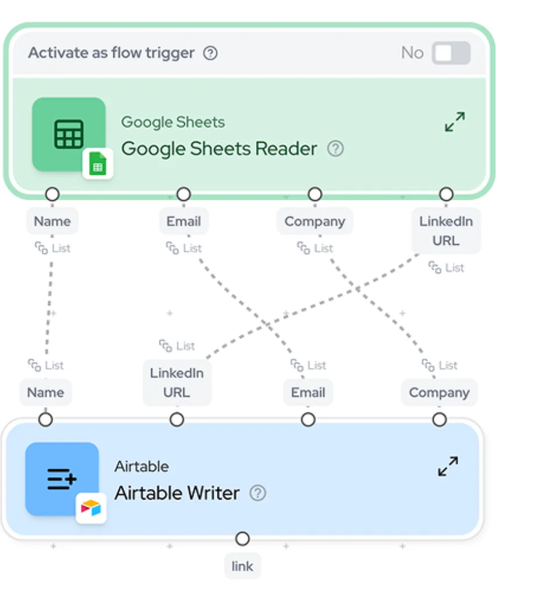

9 June 2025. My first day.

I was just glad to have a seat. A laptop in front of me. And a job I thought I already understood.

Talk to design. Talk to engineering. Talk to marketing. Write it down. Keep the work moving between them.

For a while, that really was the job.

## It wasn't that people missed the point

I want to say this clearly, because it's easy to tell this story the wrong way.

Design understood what I was saying. Marketing did too. This is not a story about teams that wouldn't listen, or about me getting tired of explaining myself.

The company changed direction.

The plan became automation. Fewer handoffs. More of the work done by systems, and by fewer people. And then there were layoffs.

The work did not shrink. The team around it did.

Screens still had to be made. Posts still had to go out. What changed was who was left to do them.

I didn't sit down one morning and decide to learn a new craft. A task would show up. The person who used to take it wasn't there. So I learned the next small piece, so the work wouldn't stop.

That's the honest version. I learned a lot of it without meaning to.

## The screens came first

Design was one of the first places I felt it.

The design team was removed. Completely. There are no designers now.

I still needed a screen before anyone could react to a feature. So I build them in Lovable. I describe the flow. I get a screen people can click through, while the question is still fresh. No design team is in that step.

On 9 June I could not have done this. I picked it up because that work landed on my desk.

## Then the words that go out with the product

Marketing went the same way. The team that used to make what goes out with the product is not there.

A feature would ship, and the words still had to exist. Not one post. A LinkedIn post. A carousel. A product video. A one-pager. A sales brief.

So I coded it.

The pipeline reads the codebase. When a feature is released, it picks that up. Then separate pipelines take over. One writes the LinkedIn post. One builds the carousel. One makes the product video. One writes the one-pager. One writes the sales brief.

That system is mine. I wrote the automation.

Gumloop comes after. The content is already made. Gumloop is how it gets distributed.

The screens, and this content system. I built both. Not as a plan I made in advance. As the job, after the job changed.

## The title barely moved. The role did.

I still work with engineering. They are still in the room. A product manager who stops doing that just builds the wrong thing, faster.

Design is not a handoff anymore. There is no design team to give a screen to. And the content does not wait on a marketing team either. A feature leaves the codebase, and the system I coded turns it into a LinkedIn post, a carousel, a product video, a one-pager and a sales brief.

I'm not only the person who connects teams anymore. A lot of the making is mine now.

One year. The title on paper looks almost the same.

The days don't.

## If the company changes under you

Sometimes your role grows because you asked for it. Sometimes the company changes, and the role grows because the work has to land somewhere.

If that happens, learn the piece sitting in front of you. You will not feel ready. I didn't. Most of what I know about prototyping, and about wiring a release in the code to a post, a carousel, a video, a one-pager and a sales brief, I learned while the task was already due.

You don't have to turn it into a grand plan later. It wasn't one.

## Same desk

I still sit at that desk. I still like the work.

I just do much more of it with my own hands than I did on 9 June 2025.
