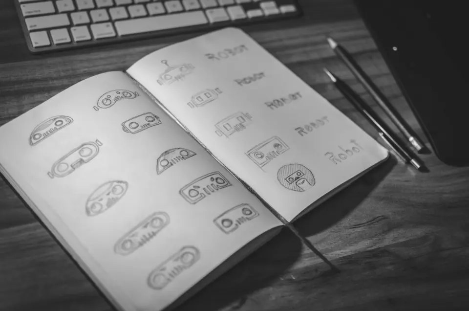
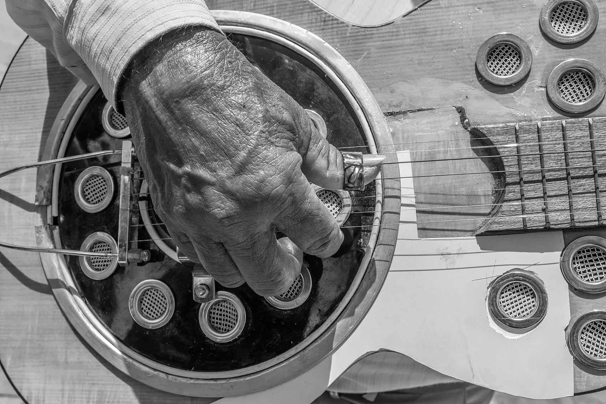

There's a version of me that only exists on weekdays.

He wakes up to Slack. He thinks in sprints. He has opinions about acceptance criteria and he says "let's take this offline" without flinching.

He's good at his job. I'm proud of him.

But he's not the whole story. And for a while, I forgot that.

## The Weekday Version of Me

When I joined Convin, I was hungry. Intern, then a PPO, then a product manager trying to prove that the kid from the hills deserved the room.

So I gave the job everything. Early mornings. Late evenings. Weekends that were "just one quick doc."

Nobody asked me to. That's the thing about corporate life: it rarely takes your time by force. You hand it over, one reasonable yes at a time.

And somewhere in all those reasonable yeses, things started going quiet.

## The Day I Noticed the Silence

It wasn't dramatic. There was no burnout movie moment.

I just opened a drawer one Sunday and found my sketchbook. The last page was months old. Half a drawing. A face I never finished.

I sat on the floor and stared at it for a long time.

Because I realised I hadn't stopped sketching because I'd lost interest. I'd stopped because I'd stopped making room. And the scariest part? I hadn't even missed it. I'd just gotten used to being less of myself.

That's how hobbies die in corporate life. Not with a goodbye. With a slow, polite fade.

## The Road Doesn't Care About Your Jira

The first thing I took back was the road.

Long rides have always been my reset button. A 5 a.m. start, the city still asleep, the highway empty, and that first cold wind that hits you like it's trying to wake up a part of you that's been snoozing all week.

Here's what nobody tells you about riding: you can't think about work on a bike. Not really. The road demands all of you. Every curve, every pothole, every truck that thinks lanes are a suggestion.

And yet.

Somewhere around the second chai stop, the problem I'd been stuck on all week quietly solves itself. Not because I worked on it. Because I finally stopped.

**Distance gives perspective.** Sometimes literally.

I've watched the sun come up over clouds at Nandi Hills and thought about a roadmap debate from Thursday. From up there, it looked exactly as big as it really was: small.

## Pencil, Paper, Patience

Sketching taught me something I use in every single product review: **how to actually look.**

When you draw a face, you can't draw what you think a face looks like. You have to draw what's in front of you. The uneven eyebrow. The shadow under the lip. The thing everyone else walks past.

That's user research. That's listening to a call recording and hearing the hesitation before "yeah, it's fine." That's noticing the one field everyone skips on a form.

I didn't learn that in a PM course. I learned it at a desk in Darjeeling, drawing the same hills a thousand times until I finally saw them.

## The Poetry I Don't Show at Work

At work, I write PRDs. Clear. Structured. Measurable.

At night, sometimes, I write poetry. Messy. Honest. Unmeasurable.

I used to think these were two different people. Now I think they're the same muscle. One helps me say exactly what a feature should do. The other helps me say exactly what I feel. And honestly? The second one is harder.

Corporate life has a vocabulary for everything except feelings. We have words for velocity, churn, and alignment. We don't have a Jira ticket for "I'm tired in a way sleep doesn't fix."

Poetry gave me those words. Urdu shayari gave me the courage to say them.

Iqbal wrote it better than I ever could:

> Your nest is not on the dome of the royal palace.
> You are a falcon. Make your home on the rocks of the mountains.

I read that line on a bad week once, and it hit different. Not because it told me to quit. Because it reminded me that the dome, the title, the corner desk, was never supposed to be the home.

And on the nights the words do come, they sound something like this:

> The city asked me who I was,
> I showed it my calendar.
> The mountains asked the same thing,
> and I didn't need to answer.

## Six Strings and a Bad Week

Music is my meditation. I sing, and I play the guitar badly enough to stay humble and well enough to feel something.

There's a specific kind of relief in playing the same four chords after a week where nothing went to plan. The song doesn't care that the release slipped. It just wants you to keep time.

And keeping time, it turns out, is half of product management. Knowing when to push. Knowing when to hold. Knowing that silence between the notes is part of the music.

## 3,500 People Who Know a Different Me

I also run an Instagram page, [@actually_arsalaan](https://www.instagram.com/actually_arsalaan/). A little over 3,500 people follow it now.

It's where the rides, the sketches, the poetry and the late-night thoughts go. The things that don't fit in a quarterly review.

Here's the funny part: at work, I live inside metrics. Followers, engagement, reach: I understand these numbers better than most.

But on that page, I made myself one promise: **this is the one place I refuse to optimise.**

I post what I love, when I feel like it. Some posts do well. Some don't. And for once, I genuinely don't care, because the point was never the number. The point was making something just because I wanted it to exist.

Do you remember the last time you did something without a KPI attached to it?

## Why This Actually Matters for Corporate Life

I'm a product guy, so let me be practical for a minute.

**Hobbies are where you're allowed to be bad.** At work, every mistake has a cost. On a sketchbook page, a wrong line is just a wrong line. That freedom to fail is where real creativity comes back from.

**Rest is not the same as recovery.** Scrolling on the couch is rest. Riding 200 km, finishing a sketch, or nailing a song you've been practising for weeks is recovery. One numbs you. The other refills you.

**They make you better at the job.** Riding taught me patience with long timelines. Sketching taught me observation. Poetry taught me to communicate. Music taught me rhythm. None of that is on my resume. All of it shows up in my work.

**Your identity needs more than one pillar.** Titles change. Teams get reshuffled. Companies have bad quarters. If your entire sense of self lives inside an org chart, one email can knock the ground out from under you. Hobbies are the parts of you no reorg can touch.

**They keep you human in rooms that forget to be.** The best people I've worked with all had a life outside work. A band. A garden. A marathon. You could feel it in how they disagreed: with curiosity instead of fear.

## What I'd Tell Anyone Starting Out

**To the fresher in their first corporate job:**
Give the job your best. Not your everything. Keep one thing that's only yours.

**To the version of me that stopped sketching:**
You didn't lose it. You just put it down. Pick it back up. The pencil remembers.

**To the manager reading this:**
When someone on your team says they're leaving early for band practice, or taking Friday off to ride to the mountains, that's not a lack of commitment. That's how they come back on Monday with something to give.

**To anyone reading this on a Sunday night with that familiar Monday dread:**
Go do the thing you used to love. Badly, if you have to. Just do it.

## The Helmet by the Door

These days, my helmet sits by the door. My sketchbook lives on my desk, not in a drawer. The guitar is never more than an arm's length away.

I still give my job a lot. I still love what I do.

But I've made peace with something it took me a while to learn:

**My job is what I do. These are who I am.**

And the version of me who shows up on Monday? He's better for it.
